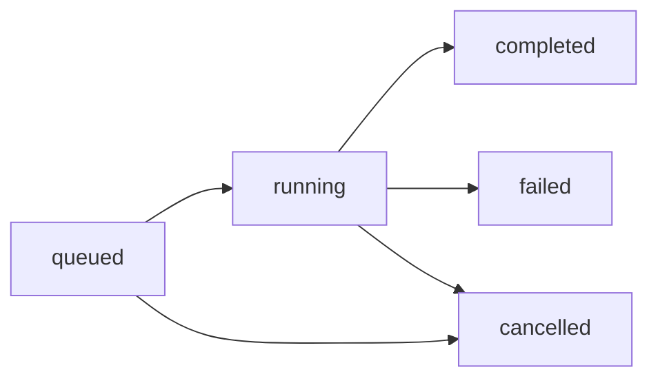

## Job State Overview

Every video generation job progresses through a series of states from submission to completion. Understanding these states helps you build robust integrations and provide accurate feedback to users.

## State Diagram



## States

### queued

The job has been submitted and is waiting for a worker to pick it up.

**Characteristics:**
- `startedAt` is `null`
- `completedAt` is `null`
- Job is in the database queue
- Can be cancelled before processing starts

**Typical Duration:** Seconds to minutes, depending on worker availability and queue depth

**Example Response:**
```json
{
  "id": "abc-123",
  "state": "queued",
  "cancelRequested": false,
  "resultPath": null,
  "errorMessage": null,
  "createdAt": "2024-03-15T10:30:00.000Z",
  "startedAt": null,
  "completedAt": null
}
```

---

### running

The job is actively being processed by a worker.

**Characteristics:**
- `startedAt` is set to the processing start time
- `completedAt` is still `null`
- Progress events are being emitted to `/api/jobs/:id/events`
- Can be cancelled, but cancellation is not immediate

**Typical Duration:** Minutes to tens of minutes, depending on:
- Number of paragraphs requested
- AI model speed
- Video clip availability
- System resources

**Example Response:**
```json
{
  "id": "abc-123",
  "state": "running",
  "cancelRequested": false,
  "resultPath": null,
  "errorMessage": null,
  "createdAt": "2024-03-15T10:30:00.000Z",
  "startedAt": "2024-03-15T10:30:05.123Z",
  "completedAt": null
}
```

---

### completed

The job finished successfully and the video is ready.

**Characteristics:**
- `completedAt` is set
- `resultPath` contains the path to the generated video file
- `errorMessage` is `null`
- No more progress events will be emitted

**Terminal State:** Yes - no further state transitions will occur

**Example Response:**
```json
{
  "id": "abc-123",
  "state": "completed",
  "cancelRequested": false,
  "resultPath": "/home/user/MoneyPrinter/output.mp4",
  "errorMessage": null,
  "createdAt": "2024-03-15T10:30:00.000Z",
  "startedAt": "2024-03-15T10:30:05.123Z",
  "completedAt": "2024-03-15T10:35:42.789Z"
}
```

---

### failed

The job encountered an unrecoverable error during processing.

**Characteristics:**
- `completedAt` is set
- `errorMessage` contains a description of what went wrong
- `resultPath` is `null`
- No more progress events will be emitted

**Terminal State:** Yes - no further state transitions will occur

**Common Failure Reasons:**
- AI model timeout or error
- Network error fetching video clips
- Insufficient disk space
- FFmpeg rendering error
- Invalid configuration

**Example Response:**
```json
{
  "id": "abc-123",
  "state": "failed",
  "cancelRequested": false,
  "resultPath": null,
  "errorMessage": "Failed to generate script: Ollama connection timeout",
  "createdAt": "2024-03-15T10:30:00.000Z",
  "startedAt": "2024-03-15T10:30:05.123Z",
  "completedAt": "2024-03-15T10:32:10.456Z"
}
```

---

### cancelled

The job was cancelled by user request.

**Characteristics:**
- `completedAt` is set
- `cancelRequested` is `true`
- `resultPath` is `null`
- `errorMessage` may contain a cancellation message
- No more progress events will be emitted

**Terminal State:** Yes - no further state transitions will occur

**How Cancellation Works:**
1. User calls `POST /api/jobs/:id/cancel`
2. `cancelRequested` flag is set to `true`
3. Worker checks this flag at safe checkpoints during processing
4. Worker stops processing and sets state to `cancelled`

**Example Response:**
```json
{
  "id": "abc-123",
  "state": "cancelled",
  "cancelRequested": true,
  "resultPath": null,
  "errorMessage": "Job cancelled by user request",
  "createdAt": "2024-03-15T10:30:00.000Z",
  "startedAt": "2024-03-15T10:30:05.123Z",
  "completedAt": "2024-03-15T10:31:20.123Z"
}
```

<Note>
  Cancellation is not immediate. The worker must reach a safe checkpoint to stop processing. This can take several seconds.
</Note>

## State Transition Table

| From State | To State | Trigger |
|------------|----------|--------|
| `queued` | `running` | Worker picks up the job |
| `queued` | `cancelled` | User cancels before processing starts |
| `running` | `completed` | Processing finishes successfully |
| `running` | `failed` | Unrecoverable error occurs |
| `running` | `cancelled` | User cancels and worker acknowledges |

## Polling Best Practices

### Detecting Completion

```python
import requests
import time

def wait_for_completion(job_id, timeout=600, poll_interval=2):
    """Wait for a job to reach a terminal state."""
    start_time = time.time()
    
    while time.time() - start_time < timeout:
        response = requests.get(f"http://localhost:8080/api/jobs/{job_id}")
        job = response.json()["job"]
        
        # Check for terminal states
        if job["state"] == "completed":
            return job["resultPath"]
        elif job["state"] == "failed":
            raise Exception(f"Job failed: {job['errorMessage']}")
        elif job["state"] == "cancelled":
            raise Exception("Job was cancelled")
        
        time.sleep(poll_interval)
    
    raise TimeoutError(f"Job did not complete within {timeout} seconds")

# Usage
try:
    video_path = wait_for_completion("abc-123")
    print(f"Video ready: {video_path}")
except Exception as e:
    print(f"Error: {e}")
```

### Recommended Poll Intervals

- **Active polling:** 2-5 seconds when actively displaying progress
- **Background polling:** 10-30 seconds when running in background
- **Event streaming:** 1-2 seconds when polling `/api/jobs/:id/events`

<Tip>
  Always include a timeout when polling to prevent infinite loops if something goes wrong.
</Tip>

## Database Schema Reference

The job states are stored in the `generation_jobs` table:

```python
class GenerationJob(Base):
    __tablename__ = "generation_jobs"
    
    id: Mapped[str]                      # UUID primary key
    status: Mapped[str]                  # State: queued|running|completed|failed|cancelled
    payload: Mapped[dict]                # Original request data
    cancel_requested: Mapped[bool]       # Cancellation flag
    result_path: Mapped[Optional[str]]   # Path to output video
    error_message: Mapped[Optional[str]] # Error description
    created_at: Mapped[datetime]         # Job creation time
    started_at: Mapped[Optional[datetime]]   # Processing start time
    completed_at: Mapped[Optional[datetime]] # Finish time (success/failure)
```

See `~/workspace/source/Backend/models.py` lines 20-58 for the full model definition.
