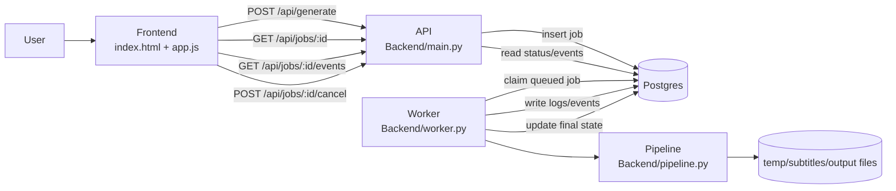
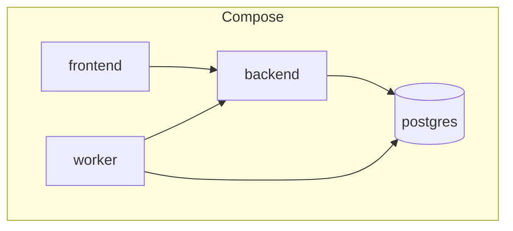
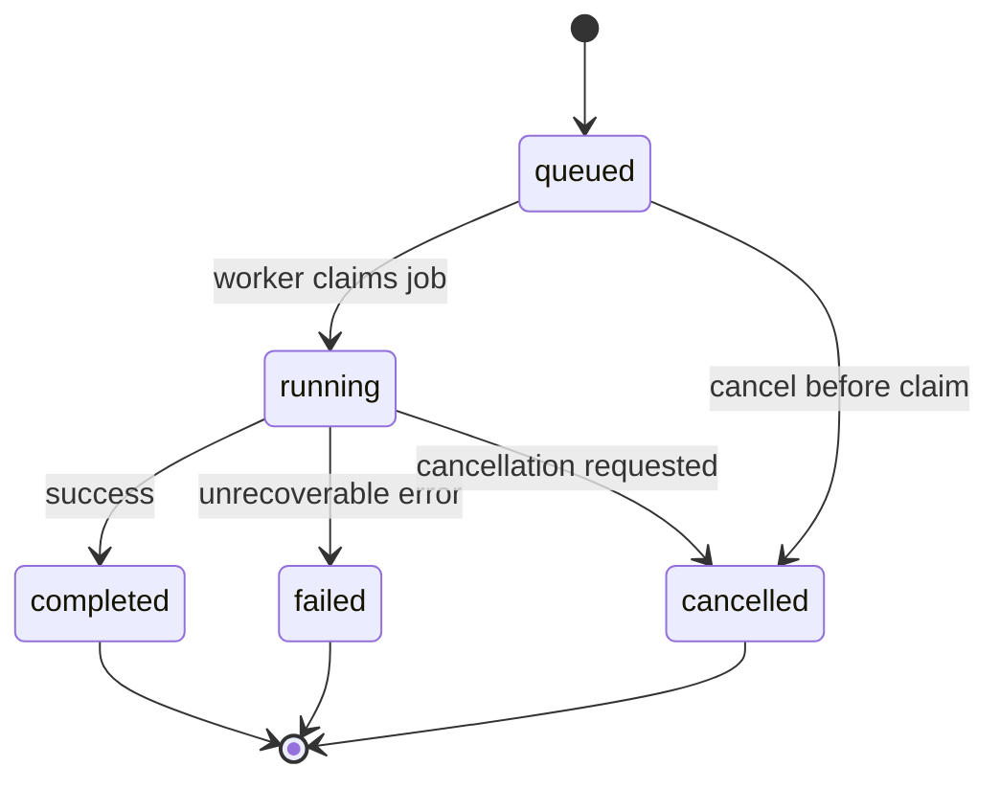
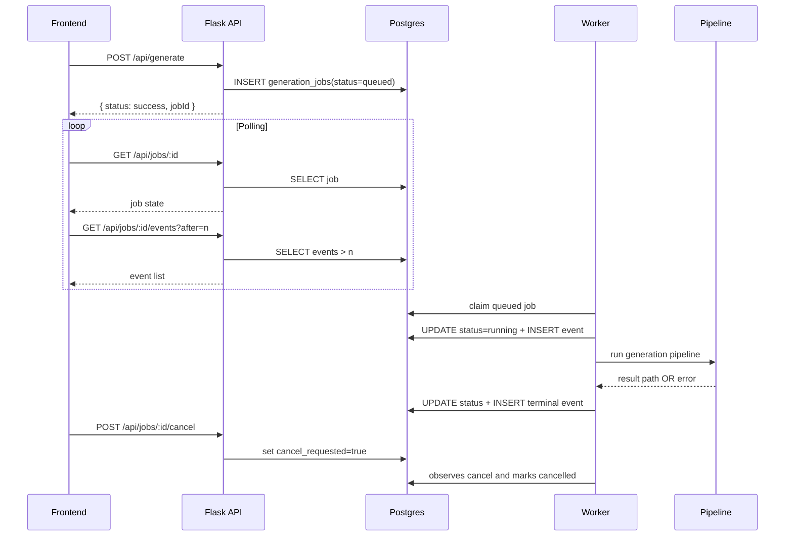
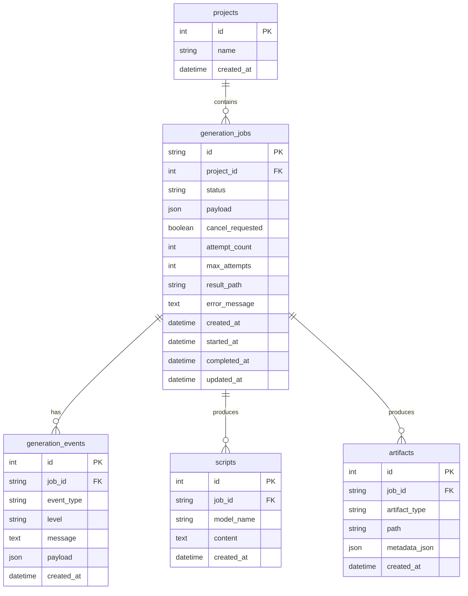

# Architecture

MoneyPrinter uses a modern, database-backed queue architecture that ensures reliability and restart safety.

## System Overview

The architecture separates concerns into distinct services:

- **Frontend**: Submits generation requests and polls job status/events
- **API (Flask)**: Validates input and enqueues jobs in the database
- **Worker**: Claims queued jobs and runs the generation pipeline
- **Database (Postgres/SQLite)**: Source of truth for job state, progress events, and artifacts



## Runtime Services (Docker)

In Docker Compose, all services run in separate containers:



## Generation Lifecycle

Jobs transition through well-defined states:



### State Definitions

| State | Description |
|-------|-------------|
| `queued` | Job created, waiting for worker to claim |
| `running` | Worker has claimed job and is executing pipeline |
| `completed` | Video generated successfully |
| `failed` | Unrecoverable error occurred |
| `cancelled` | User requested cancellation |

## API + Worker Sequence

Detailed flow showing how services interact:



## Data Model

The database schema supports the complete job lifecycle:



### Table Definitions

<Accordion title="generation_jobs">
Core job tracking table:

```python Backend/models.py
class GenerationJob(Base):
    __tablename__ = "generation_jobs"

    id: Mapped[str] = mapped_column(String(36), primary_key=True)
    project_id: Mapped[Optional[int]] = mapped_column(
        Integer,
        ForeignKey("projects.id", ondelete="SET NULL"),
        nullable=True,
        index=True,
    )
    status: Mapped[str] = mapped_column(String(20), nullable=False, index=True)
    payload: Mapped[dict] = mapped_column(JSON, nullable=False)
    cancel_requested: Mapped[bool] = mapped_column(
        Boolean, nullable=False, default=False
    )
    attempt_count: Mapped[int] = mapped_column(Integer, nullable=False, default=0)
    max_attempts: Mapped[int] = mapped_column(Integer, nullable=False, default=1)
    result_path: Mapped[Optional[str]] = mapped_column(String(512), nullable=True)
    error_message: Mapped[Optional[str]] = mapped_column(Text, nullable=True)
    created_at: Mapped[datetime] = mapped_column(
        DateTime(timezone=True), server_default=func.now(), nullable=False, index=True
    )
    started_at: Mapped[Optional[datetime]] = mapped_column(
        DateTime(timezone=True), nullable=True
    )
    completed_at: Mapped[Optional[datetime]] = mapped_column(
        DateTime(timezone=True), nullable=True
    )
    updated_at: Mapped[datetime] = mapped_column(
        DateTime(timezone=True),
        server_default=func.now(),
        onupdate=func.now(),
        nullable=False,
    )
```
</Accordion>

<Accordion title="generation_events">
Real-time progress logging:

```python Backend/models.py
class GenerationEvent(Base):
    __tablename__ = "generation_events"

    id: Mapped[int] = mapped_column(Integer, primary_key=True, autoincrement=True)
    job_id: Mapped[str] = mapped_column(
        String(36),
        ForeignKey("generation_jobs.id", ondelete="CASCADE"),
        nullable=False,
        index=True,
    )
    event_type: Mapped[str] = mapped_column(String(20), nullable=False, default="log")
    level: Mapped[str] = mapped_column(String(20), nullable=False, default="info")
    message: Mapped[str] = mapped_column(Text, nullable=False)
    payload: Mapped[Optional[dict]] = mapped_column(JSON, nullable=True)
    created_at: Mapped[datetime] = mapped_column(
        DateTime(timezone=True), server_default=func.now(), nullable=False, index=True
    )
```
</Accordion>

## Core Components

### API Server (Backend/main.py)

Fast, non-blocking Flask API:

```python Backend/main.py
@app.route("/api/generate", methods=["POST"])
def generate():
    data = request.get_json() or {}
    if not data.get("videoSubject"):
        return jsonify({"status": "error", "message": "videoSubject is required."}), 400

    with SessionLocal() as session:
        job = create_job(session, payload=data)

    return jsonify(
        {
            "status": "success",
            "message": "Video generation queued.",
            "jobId": job.id,
        }
    )
```

Key endpoints:

| Endpoint | Method | Description |
|----------|--------|-------------|
| `/api/models` | GET | List available Ollama models |
| `/api/generate` | POST | Queue a new video generation job |
| `/api/jobs/:id` | GET | Get job status |
| `/api/jobs/:id/events` | GET | Fetch job events (with pagination) |
| `/api/jobs/:id/cancel` | POST | Request job cancellation |
| `/api/upload-songs` | POST | Upload background music |

### Worker (Backend/worker.py)

Polls for queued jobs and executes the pipeline:

```python Backend/worker.py
def process_next_job() -> bool:
    with SessionLocal() as session:
        job = claim_next_queued_job(session)

    if not job:
        return False

    job_id = job.id

    clean_dir(str(TEMP_DIR))
    clean_dir(str(SUBTITLES_DIR))

    try:
        result_path = run_generation_pipeline(
            data=job.payload,
            is_cancelled=lambda: _job_cancelled(job_id),
            on_log=lambda message, level: _log_event(job_id, message, level),
        )
        with SessionLocal() as session:
            mark_completed(session, job_id, result_path)
    except PipelineCancelled as err:
        with SessionLocal() as session:
            mark_cancelled(session, job_id, str(err))
    except Exception as err:
        with SessionLocal() as session:
            mark_failed(session, job_id, str(err))

    return True


def main() -> None:
    load_dotenv(ENV_FILE)
    check_env_vars()
    init_db()

    while True:
        processed = process_next_job()
        if not processed:
            time.sleep(POLL_SECONDS)
```

Worker characteristics:
- **Restartable**: Jobs survive worker crashes
- **Cancellation-aware**: Checks `cancel_requested` flag during processing
- **Event streaming**: Logs progress to database in real-time

### Job Queue (Backend/repository.py)

Database operations with Postgres-optimized locking:

```python Backend/repository.py
def claim_next_queued_job(session: Session) -> Optional[GenerationJob]:
    dialect = session.bind.dialect.name if session.bind else ""

    if dialect == "postgresql":
        # Use SKIP LOCKED for concurrent workers
        row = session.execute(
            text(
                """
                SELECT id
                FROM generation_jobs
                WHERE status = 'queued' AND cancel_requested = false
                ORDER BY created_at ASC
                FOR UPDATE SKIP LOCKED
                LIMIT 1
                """
            )
        ).first()
        if not row:
            return None
        job = get_job(session, row[0])
    else:
        # Fallback for SQLite
        stmt = (
            select(GenerationJob)
            .where(
                and_(
                    GenerationJob.status == "queued",
                    GenerationJob.cancel_requested.is_(False),
                )
            )
            .order_by(GenerationJob.created_at.asc())
            .limit(1)
        )
        job = session.scalars(stmt).first()

    if not job:
        return None

    job.status = "running"
    job.attempt_count = (job.attempt_count or 0) + 1
    job.started_at = utcnow()
    job.updated_at = utcnow()
    append_event(session, job.id, "running", "info", "Job started.")
    session.commit()
    session.refresh(job)
    return job
```

<Info>
The `SKIP LOCKED` clause allows multiple workers to process jobs concurrently without contention.
</Info>

## Current Guarantees

<CardGroup cols={2}>
  <Card title="Non-blocking API" icon="bolt">
    API responds immediately after enqueuing. No long-running requests.
  </Card>
  
  <Card title="Restart safety" icon="rotate">
    Job state and logs survive API/worker restarts. Resume processing on startup.
  </Card>
  
  <Card title="Job-scoped cancellation" icon="xmark">
    Cancellation is checked during processing via `cancel_requested` flag.
  </Card>
  
  <Card title="Progress recovery" icon="clock-rotate-left">
    Frontend can recover progress after refresh by polling persisted events.
  </Card>
</CardGroup>

## Planned Enhancements

- **Migration tool**: Add Alembic for schema versioning
- **Retry logic**: Implement backoff with `next_retry_at` and dead-letter queue
- **Artifact tracking**: Populate metadata and checksums for generated files
- **Worker metrics**: Add queue depth, throughput, and latency endpoints
- **Horizontal scaling**: Multi-worker support with distributed locking

## Next Steps

<CardGroup cols={2}>
  <Card title="Job Queue" icon="list" href="/concepts/job-queue">
    Deep dive into the database-backed queue
  </Card>
  
  <Card title="Pipeline" icon="diagram-project" href="/concepts/pipeline">
    Understand the video generation pipeline
  </Card>
  
  <Card title="Generating Videos" icon="video" href="/guides/generating-videos">
    Create videos through UI and API
  </Card>
  
  <Card title="Docker Setup" icon="docker" href="/setup/docker">
    Deploy the full stack with Docker
  </Card>
</CardGroup>
