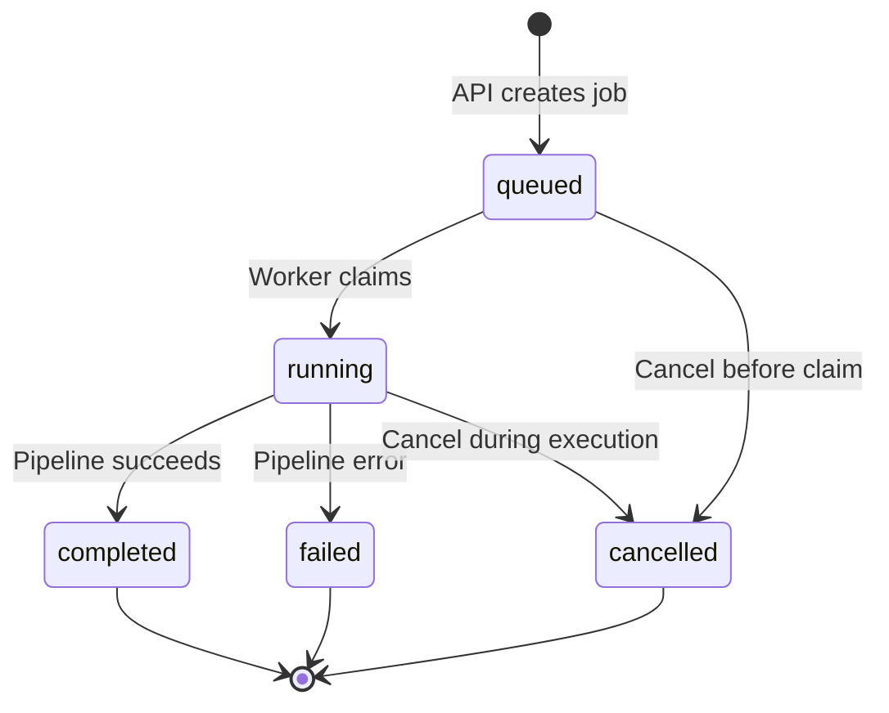

# Job Queue

MoneyPrinter uses a database-backed job queue for reliable, restart-safe video generation processing.

## Why a Database Queue?

Traditional in-memory queues lose state on restart. MoneyPrinter's database queue provides:

<CardGroup cols={2}>
  <Card title="Durability" icon="database">
    Jobs persist across API/worker restarts
  </Card>
  
  <Card title="Observability" icon="eye">
    Query job status and history with SQL
  </Card>
  
  <Card title="Concurrent workers" icon="users">
    Multiple workers can process jobs simultaneously
  </Card>
  
  <Card title="Cancellation" icon="ban">
    Jobs can be cancelled mid-execution
  </Card>
</CardGroup>

## Job Lifecycle

Jobs transition through five states:



### State Transitions

| From | To | Trigger | Description |
|------|----|---------| ------------- |
| - | `queued` | API call | Job created, waiting for worker |
| `queued` | `running` | Worker claims | Worker starts processing |
| `queued` | `cancelled` | Cancel request | Cancelled before worker claimed |
| `running` | `completed` | Pipeline success | Video generated successfully |
| `running` | `failed` | Pipeline error | Unrecoverable error occurred |
| `running` | `cancelled` | Cancel request | User cancelled during execution |

## Creating Jobs

Jobs are created via the API `/api/generate` endpoint:

```python Backend/main.py
@app.route("/api/generate", methods=["POST"])
def generate():
    data = request.get_json() or {}
    if not data.get("videoSubject"):
        return jsonify({"status": "error", "message": "videoSubject is required."}), 400

    with SessionLocal() as session:
        job = create_job(session, payload=data)

    return jsonify(
        {
            "status": "success",
            "message": "Video generation queued.",
            "jobId": job.id,
        }
    )
```

The `create_job` function:

```python Backend/repository.py
def create_job(session: Session, payload: dict, max_attempts: int = 1) -> GenerationJob:
    job = GenerationJob(
        id=str(uuid4()),
        status="queued",
        payload=payload,
        max_attempts=max_attempts,
        cancel_requested=False,
    )
    session.add(job)
    session.flush()
    append_event(session, job.id, "queued", "info", "Job queued.")
    session.commit()
    session.refresh(job)
    return job
```

### Job Payload

The job payload contains all parameters for video generation:

```json
{
  "videoSubject": "Top 5 AI Tools",
  "aiModel": "llama3.1:8b",
  "voice": "en_us_001",
  "paragraphNumber": 1,
  "customPrompt": "",
  "subtitlesPosition": "center",
  "color": "#FFFF00",
  "useMusic": true,
  "automateYoutubeUpload": false,
  "threads": 2
}
```

## Claiming Jobs (Worker)

Workers poll the database for queued jobs:

```python Backend/worker.py
def process_next_job() -> bool:
    with SessionLocal() as session:
        job = claim_next_queued_job(session)

    if not job:
        return False

    # Process job...
    return True

def main() -> None:
    load_dotenv(ENV_FILE)
    check_env_vars()
    init_db()

    while True:
        processed = process_next_job()
        if not processed:
            time.sleep(POLL_SECONDS)  # 1.0 second
```

### Claiming Logic

The `claim_next_queued_job` function uses database-level locking:

```python Backend/repository.py
def claim_next_queued_job(session: Session) -> Optional[GenerationJob]:
    dialect = session.bind.dialect.name if session.bind else ""

    if dialect == "postgresql":
        # Postgres: use SKIP LOCKED for concurrent workers
        row = session.execute(
            text(
                """
                SELECT id
                FROM generation_jobs
                WHERE status = 'queued' AND cancel_requested = false
                ORDER BY created_at ASC
                FOR UPDATE SKIP LOCKED
                LIMIT 1
                """
            )
        ).first()
        if not row:
            return None
        job = get_job(session, row[0])
    else:
        # SQLite fallback (no SKIP LOCKED)
        stmt = (
            select(GenerationJob)
            .where(
                and_(
                    GenerationJob.status == "queued",
                    GenerationJob.cancel_requested.is_(False),
                )
            )
            .order_by(GenerationJob.created_at.asc())
            .limit(1)
        )
        job = session.scalars(stmt).first()

    if not job:
        return None

    # Mark as running
    job.status = "running"
    job.attempt_count = (job.attempt_count or 0) + 1
    job.started_at = utcnow()
    job.updated_at = utcnow()
    append_event(session, job.id, "running", "info", "Job started.")
    session.commit()
    session.refresh(job)
    return job
```

<Info>
**Postgres**: `FOR UPDATE SKIP LOCKED` allows multiple workers to claim different jobs concurrently without blocking.

**SQLite**: Single-worker setup recommended (no row-level locking).
</Info>

## Event Logging

Events provide real-time progress updates:

```python Backend/repository.py
def append_event(
    session: Session,
    job_id: str,
    event_type: str,
    level: str,
    message: str,
    payload: Optional[dict] = None,
) -> GenerationEvent:
    event = GenerationEvent(
        job_id=job_id,
        event_type=event_type,
        level=level,
        message=message,
        payload=payload,
    )
    session.add(event)
    session.flush()
    return event
```

### Event Types

| Type | Level | Description |
|------|-------|-------------|
| `queued` | info | Job created |
| `running` | info | Worker started processing |
| `log` | info/warning/error | Pipeline progress message |
| `cancel_requested` | warning | User requested cancellation |
| `cancelled` | warning | Job cancelled |
| `complete` | success | Video generated |
| `error` | error | Pipeline failed |

### Frontend Polling

The frontend polls for new events:

```javascript Frontend/app.js
async function pollJobEvents(jobId, afterEventId) {
  const response = await apiRequest(`/api/jobs/${jobId}/events?after=${afterEventId}`);
  
  if (response.status === 'success') {
    response.events.forEach(event => {
      appendLog(event.message, event.level);
    });
    
    if (response.events.length > 0) {
      const lastEvent = response.events[response.events.length - 1];
      return lastEvent.id;  // Next poll starts after this ID
    }
  }
  
  return afterEventId;
}
```

## Job Completion

Jobs reach a terminal state (completed, failed, or cancelled):

### Success

```python Backend/repository.py
def mark_completed(session: Session, job_id: str, result_path: str) -> None:
    job = get_job(session, job_id)
    if not job:
        return
    job.status = "completed"
    job.result_path = result_path
    job.error_message = None
    job.completed_at = utcnow()
    job.updated_at = utcnow()
    append_event(
        session,
        job.id,
        "complete",
        "success",
        "Video generated successfully.",
        {"path": result_path},
    )
    session.commit()
```

### Failure

```python Backend/repository.py
def mark_failed(session: Session, job_id: str, error_message: str) -> None:
    job = get_job(session, job_id)
    if not job:
        return
    job.status = "failed"
    job.error_message = error_message
    job.completed_at = utcnow()
    job.updated_at = utcnow()
    append_event(session, job.id, "error", "error", error_message)
    session.commit()
```

### Cancellation

```python Backend/repository.py
def mark_cancelled(
    session: Session, job_id: str, reason: str = "Job cancelled."
) -> None:
    job = get_job(session, job_id)
    if not job:
        return
    job.status = "cancelled"
    job.completed_at = utcnow()
    job.updated_at = utcnow()
    append_event(session, job.id, "cancelled", "warning", reason)
    session.commit()
```

## Cancellation

Jobs can be cancelled at any stage:

### Requesting Cancellation

```python Backend/repository.py
def request_cancel(session: Session, job_id: str) -> bool:
    job = get_job(session, job_id)
    if not job:
        return False

    if job.status in ("completed", "failed", "cancelled"):
        return True  # Already terminal

    job.cancel_requested = True
    job.updated_at = utcnow()
    append_event(
        session, job.id, "cancel_requested", "warning", "Cancellation requested."
    )

    # Immediately cancel queued jobs
    if job.status == "queued":
        job.status = "cancelled"
        job.completed_at = utcnow()
        append_event(
            session, job.id, "cancelled", "warning", "Job cancelled before execution."
        )

    session.commit()
    return True
```

### Checking Cancellation (Pipeline)

The worker checks cancellation status during processing:

```python Backend/pipeline.py
def run_generation_pipeline(
    data: dict,
    is_cancelled,
    on_log,
    amount_of_stock_videos: int = 5,
) -> str:
    def guard_cancelled() -> None:
        if is_cancelled and is_cancelled():
            raise PipelineCancelled("Video generation was cancelled.")

    # Check before expensive operations
    guard_cancelled()
    script = generate_script(...)
    
    guard_cancelled()
    video_urls = search_for_stock_videos(...)
    
    guard_cancelled()
    # ...
```

## Querying Jobs

Frontend and API query job state:

```python Backend/main.py
@app.route("/api/jobs/<job_id>", methods=["GET"])
def get_job_status(job_id: str):
    with SessionLocal() as session:
        job = get_job(session, job_id)
        if not job:
            return jsonify({"status": "error", "message": "Job not found."}), 404

        return jsonify(
            {
                "status": "success",
                "job": {
                    "id": job.id,
                    "state": job.status,
                    "cancelRequested": job.cancel_requested,
                    "resultPath": job.result_path,
                    "errorMessage": job.error_message,
                    "createdAt": job.created_at.isoformat() if job.created_at else None,
                    "startedAt": job.started_at.isoformat() if job.started_at else None,
                    "completedAt": job.completed_at.isoformat()
                    if job.completed_at
                    else None,
                },
            }
        )
```

## Scaling Considerations

### Multiple Workers

Run multiple workers for higher throughput:

```bash
# Terminal 1
uv run python Backend/worker.py

# Terminal 2
uv run python Backend/worker.py

# Terminal 3
uv run python Backend/worker.py
```

Or with Docker:

```bash
docker compose up --scale worker=5
```

<Warning>
Multiple workers require **Postgres** with `SKIP LOCKED`. SQLite does not support concurrent claims.
</Warning>

### Queue Metrics

Query queue depth and worker utilization:

```sql
-- Queued jobs
SELECT COUNT(*) FROM generation_jobs WHERE status = 'queued';

-- Running jobs
SELECT COUNT(*) FROM generation_jobs WHERE status = 'running';

-- Average completion time
SELECT AVG(EXTRACT(EPOCH FROM (completed_at - created_at))) as avg_seconds
FROM generation_jobs
WHERE status = 'completed'
  AND completed_at > NOW() - INTERVAL '1 hour';
```

## Future Enhancements

- **Retry logic**: Automatic retry with exponential backoff
- **Priority queue**: High-priority jobs skip to front
- **Dead-letter queue**: Archive permanently failed jobs
- **Job expiration**: Auto-cancel jobs older than N hours
- **Batch processing**: Process multiple jobs per worker cycle

## Next Steps

<CardGroup cols={2}>
  <Card title="Architecture" icon="sitemap" href="/concepts/architecture">
    System design overview
  </Card>
  
  <Card title="Pipeline" icon="diagram-project" href="/concepts/pipeline">
    Video generation pipeline
  </Card>
  
  <Card title="Generating Videos" icon="video" href="/guides/generating-videos">
    Create videos through UI and API
  </Card>
  
  <Card title="Docker Setup" icon="docker" href="/setup/docker">
    Deploy with multiple workers
  </Card>
</CardGroup>
