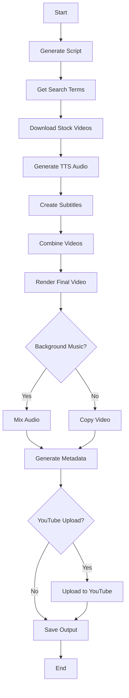

# Video Generation Pipeline

The pipeline orchestrates all stages of video generation: script creation, voice synthesis, video composition, and optional YouTube upload.

## Pipeline Overview

The `run_generation_pipeline` function coordinates the entire workflow:

```python Backend/pipeline.py
def run_generation_pipeline(
    data: dict,
    is_cancelled,
    on_log,
    amount_of_stock_videos: int = 5,
) -> str:
    # Returns the path to the generated video
```

### Pipeline Stages



## Stage 1: Script Generation

Generate the video script using Ollama:

```python Backend/pipeline.py
script = generate_script(
    data["videoSubject"],
    paragraph_number,
    ai_model,
    voice,
    data["customPrompt"],
)

if not script:
    raise RuntimeError(
        "Could not generate a script. Try a different model or prompt."
    )
```

The `generate_script` function uses Ollama's chat API:

```python Backend/gpt.py
def generate_script(
    video_subject: str,
    paragraph_number: int,
    ai_model: str,
    voice: str,
    customPrompt: str,
) -> Optional[str]:
    if customPrompt:
        prompt = customPrompt
    else:
        prompt = f"""
        Generate a script for a video, depending on the subject of the video.
        The script is to be returned as a string with the specified number of paragraphs.
        
        YOU MUST NOT INCLUDE ANY TYPE OF MARKDOWN OR FORMATTING IN THE SCRIPT.
        YOU MUST WRITE THE SCRIPT IN THE LANGUAGE SPECIFIED IN [LANGUAGE].
        ONLY RETURN THE RAW CONTENT OF THE SCRIPT.
        
        Subject: {video_subject}
        Number of paragraphs: {paragraph_number}
        Language: {voice}
        """

    response = generate_response(prompt, ai_model)
    
    # Clean the response
    response = response.replace("*", "").replace("#", "")
    response = re.sub(r"\[.*\]", "", response)
    response = re.sub(r"\(.*\)", "", response)
    
    paragraphs = response.split("\n\n")
    selected_paragraphs = paragraphs[:paragraph_number]
    final_script = "\n\n".join(selected_paragraphs)
    
    return final_script
```

<Info>
Custom prompts override the default script generation prompt entirely.
</Info>

## Stage 2: Search Terms

Generate search terms for stock video clips:

```python Backend/pipeline.py
search_terms = get_search_terms(
    data["videoSubject"], amount_of_stock_videos, script, ai_model
)
```

The AI generates relevant keywords:

```python Backend/gpt.py
def get_search_terms(
    video_subject: str, amount: int, script: str, ai_model: str
) -> List[str]:
    prompt = f"""
    Generate {amount} search terms for stock videos,
    depending on the subject of a video.
    Subject: {video_subject}

    The search terms are to be returned as a JSON-Array of strings.
    Each search term should consist of 1-3 words.
    
    YOU MUST ONLY RETURN THE JSON-ARRAY OF STRINGS.
    
    For context, here is the full text:
    {script}
    """

    response = generate_response(prompt, ai_model)
    search_terms = json.loads(response)
    
    return search_terms
```

Example output:

```json
["artificial intelligence", "robot technology", "future innovation", "AI coding", "machine learning"]
```

## Stage 3: Download Stock Videos

Fetch video clips from Pexels:

```python Backend/pipeline.py
video_urls = []
it = 15  # Max results per search
min_dur = 10  # Minimum duration in seconds

for search_term in search_terms:
    guard_cancelled()  # Check for cancellation
    found_urls = search_for_stock_videos(
        search_term, os.getenv("PEXELS_API_KEY"), it, min_dur
    )
    for url in found_urls:
        if url not in video_urls:
            video_urls.append(url)
            break  # Take first unique video

if not video_urls:
    raise RuntimeError("No videos found to download.")
```

Download videos:

```python Backend/pipeline.py
video_paths = []
emit(f"[+] Downloading {len(video_urls)} videos...", "info")

for video_url in video_urls:
    guard_cancelled()
    try:
        saved_video_path = save_video(video_url)
        video_paths.append(saved_video_path)
    except Exception:
        emit(f"[-] Could not download video: {video_url}", "error")
```

## Stage 4: Text-to-Speech

Generate audio from the script using TikTok TTS:

```python Backend/pipeline.py
sentences = script.split(". ")
sentences = list(filter(lambda x: x != "", sentences))
paths = []

for sentence in sentences:
    guard_cancelled()
    current_tts_path = str(TEMP_DIR / f"{uuid4()}.mp3")
    tts(sentence, voice, filename=current_tts_path)
    audio_clip = AudioFileClip(current_tts_path)
    paths.append(audio_clip)

# Concatenate all audio clips
final_audio = concatenate_audioclips(paths)
tts_path = str(TEMP_DIR / f"{uuid4()}.mp3")
try:
    final_audio.write_audiofile(tts_path)
finally:
    final_audio.close()
    for audio_clip in paths:
        audio_clip.close()
```

<Accordion title="TikTok TTS Implementation">
The TikTok voice API is called for each sentence:

```python Backend/tiktokvoice.py
def tts(text: str, voice: str, filename: str = "voice.mp3") -> None:
    url = f"https://api16-normal-useast5.us.tiktokv.com/media/api/text/speech/invoke/?text_speaker={voice}&req_text={text}&speaker_map_type=0&aid=1233"
    
    headers = {
        "User-Agent": "com.zhiliaoapp.musically/2022600030 (Linux; U; Android 7.1.2; es_ES; SM-G988N; Build/NRD90M;tt-ok/3.12.13.1)",
        "Cookie": f"sessionid={os.getenv('TIKTOK_SESSION_ID')}"
    }
    
    response = requests.post(url, headers=headers)
    # Decode base64 audio and save
```
</Accordion>

## Stage 5: Subtitle Generation

Generate subtitles using AssemblyAI (if configured) or local processing:

```python Backend/pipeline.py
try:
    subtitles_path = generate_subtitles(
        audio_path=tts_path,
        sentences=sentences,
        audio_clips=paths,
        voice=voice_prefix,
    )
except Exception as err:
    emit(f"[-] Error generating subtitles: {err}", "error")
    subtitles_path = None

if not subtitles_path:
    raise RuntimeError(
        "Could not generate subtitles. Check AssemblyAI key or local subtitle settings."
    )
```

### Local Subtitle Generation

```python Backend/video.py
def __generate_subtitles_locally(
    sentences: List[str], audio_clips: List[AudioFileClip]
) -> str:
    def convert_to_srt_time_format(total_seconds: float) -> str:
        milliseconds_total = int(round(total_seconds * 1000))
        hours, remainder = divmod(milliseconds_total, 3_600_000)
        minutes, remainder = divmod(remainder, 60_000)
        seconds, milliseconds = divmod(remainder, 1000)
        return f"{hours:02d}:{minutes:02d}:{seconds:02d},{milliseconds:03d}"

    start_time = 0.0
    subtitles = []
    
    for i, (sentence, audio_clip) in enumerate(zip(sentences, audio_clips)):
        duration = audio_clip.duration
        end_time = start_time + duration
        
        subtitle_entry = f"{i + 1}\n"
        subtitle_entry += f"{convert_to_srt_time_format(start_time)} --> {convert_to_srt_time_format(end_time)}\n"
        subtitle_entry += f"{sentence}\n"
        
        subtitles.append(subtitle_entry)
        start_time = end_time
    
    return "\n".join(subtitles)
```

## Stage 6: Combine Videos

Stitch stock videos together to match audio duration:

```python Backend/pipeline.py
temp_audio = AudioFileClip(tts_path)
try:
    combined_video_path = combine_videos(
        video_paths, temp_audio.duration, 5, n_threads or 2
    )
finally:
    temp_audio.close()
```

The `combine_videos` function:

```python Backend/video.py
def combine_videos(
    video_paths: list,
    max_duration: float,
    max_clip_duration: int,
    threads: int,
) -> str:
    """Combines a list of videos into one video and returns the path to the combined video."""
    video_clips = []
    
    for video_path in video_paths:
        clip = VideoFileClip(video_path)
        clip = clip.without_audio()
        
        # Resize to 1080x1920 (vertical)
        clip = clip.resized(height=1920)
        clip = clip.cropped(width=1080, height=1920, x_center=clip.w / 2, y_center=clip.h / 2)
        
        video_clips.append(clip)
    
    # Concatenate clips
    final_clip = concatenate_videoclips(video_clips)
    final_clip = final_clip.subclipped(0, max_duration)
    
    output_path = TEMP_DIR / f"{uuid4()}_combined.mp4"
    final_clip.write_videofile(
        str(output_path),
        threads=threads,
        codec="libx264",
        fps=30,
    )
    
    return str(output_path)
```

## Stage 7: Render Final Video

Composite video with audio and subtitles:

```python Backend/pipeline.py
try:
    final_video_path = generate_video(
        combined_video_path,
        tts_path,
        subtitles_path,
        n_threads or 2,
        subtitles_position,
        text_color or "#FFFF00",
    )
except Exception as err:
    raise RuntimeError(
        f"Could not render final video. Check subtitle/font/ImageMagick setup. ({err})"
    ) from err
```

The `generate_video` function uses ImageMagick for subtitle rendering:

```python Backend/video.py
def generate_video(
    combined_video_path: str,
    audio_path: str,
    subtitle_path: str,
    threads: int,
    subtitles_position: str,
    text_color: str,
) -> str:
    # Load video and audio
    video = VideoFileClip(combined_video_path)
    audio = AudioFileClip(audio_path)
    
    # Create subtitle clip
    generator = lambda txt: TextClip(
        text=txt,
        font_size=70,
        color=text_color,
        stroke_color="black",
        stroke_width=5,
        font=str(FONTS_DIR / "bold_font.ttf"),
        size=video.size,
        method="caption",
    )
    
    subtitles = SubtitlesClip(subtitle_path, generator)
    
    # Position subtitles
    if subtitles_position == "center":
        subtitles = subtitles.with_position(("center", "center"))
    else:
        subtitles = subtitles.with_position(("center", "bottom"))
    
    # Composite final video
    final = CompositeVideoClip([video, subtitles])
    final = final.with_audio(audio)
    
    output_path = TEMP_DIR / f"{uuid4()}.mp4"
    final.write_videofile(
        str(output_path),
        threads=threads,
        codec="libx264",
        audio_codec="aac",
        fps=30,
    )
    
    return str(output_path)
```

## Stage 8: Background Music (Optional)

Mix background music with the video audio:

```python Backend/pipeline.py
if use_music:
    song_path = choose_random_song()
    
    if not song_path:
        emit("[-] Could not find songs in Songs/. Continuing without music.", "warning")
        use_music = False

    if use_music:
        video_clip = VideoFileClip(rendered_video_path)
        song_clip = AudioFileClip(song_path).with_fps(44100)
        
        # Loop song to match video duration
        song_clip = song_clip.with_effects(
            [afx.AudioLoop(duration=video_clip.duration)]
        )
        
        # Reduce volume to 10%
        song_clip = song_clip.with_volume_scaled(0.1)
        
        # Mix audio tracks
        mixed_audio = CompositeAudioClip(
            [video_clip.audio, song_clip]
        ).with_duration(video_clip.duration)
        
        # Remux with ffmpeg
        subprocess.run([
            "ffmpeg", "-y",
            "-i", rendered_video_path,
            "-i", mixed_audio_path,
            "-map", "0:v:0",
            "-map", "1:a:0",
            "-c:v", "copy",
            "-c:a", "aac",
            "-shortest",
            final_output_path,
        ], check=True)
```

## Stage 9: Metadata Generation

Generate YouTube title, description, and keywords:

```python Backend/pipeline.py
title, description, keywords = generate_metadata(
    data["videoSubject"], script, ai_model
)

emit("[-] Metadata for YouTube upload:", "info")
emit("   Title:", "info")
emit(f"   {title}", "info")
emit("   Description:", "info")
emit(f"   {description}", "info")
emit("   Keywords:", "info")
emit(f"  {', '.join(keywords)}", "info")
```

## Stage 10: YouTube Upload (Optional)

Upload the video to YouTube using OAuth:

```python Backend/pipeline.py
if automate_youtube_upload:
    client_secrets_file = str((BASE_DIR / "client_secret.json").resolve())
    
    if not os.path.exists(client_secrets_file):
        emit("[-] Client secrets file missing. YouTube upload will be skipped.", "warning")
    else:
        video_metadata = {
            "video_path": final_video_path,
            "title": title,
            "description": description,
            "category": "28",  # Science & Technology
            "keywords": ",".join(keywords),
            "privacyStatus": "private",
        }
        
        try:
            video_response = upload_video(**video_metadata)
            emit(f"Uploaded video ID: {video_response.get('id')}", "success")
        except HttpError as err:
            emit(f"An HTTP error {err.resp.status} occurred", "error")
```

## Cancellation Handling

The pipeline checks for cancellation throughout:

```python Backend/pipeline.py
def guard_cancelled() -> None:
    if is_cancelled and is_cancelled():
        raise PipelineCancelled("Video generation was cancelled.")

# Called before expensive operations:
guard_cancelled()  # Before script generation
guard_cancelled()  # Before video downloads
guard_cancelled()  # Before TTS
guard_cancelled()  # Before final render
```

When cancelled, the worker catches the exception:

```python Backend/worker.py
try:
    result_path = run_generation_pipeline(...)
    mark_completed(session, job_id, result_path)
except PipelineCancelled as err:
    mark_cancelled(session, job_id, str(err))
except Exception as err:
    mark_failed(session, job_id, str(err))
```

## Performance Considerations

### Threading

Video rendering uses multiple threads:

```python
n_threads = data.get("threads") or 2
video_clip.write_videofile(output_path, threads=n_threads)
```

Recommended values:
- **2-4 threads**: Standard CPUs
- **8-16 threads**: High-end CPUs
- **Auto**: `os.cpu_count()`

### Temporary File Cleanup

The worker cleans up temp directories before each job:

```python Backend/worker.py
clean_dir(str(TEMP_DIR))
clean_dir(str(SUBTITLES_DIR))
```

## Next Steps

<CardGroup cols={2}>
  <Card title="Generating Videos" icon="video" href="/guides/generating-videos">
    Create videos through UI and API
  </Card>
  
  <Card title="Ollama Models" icon="brain" href="/guides/ollama-models">
    Choose the right model for your use case
  </Card>
  
  <Card title="Background Music" icon="music" href="/guides/background-music">
    Add music to your videos
  </Card>
  
  <Card title="YouTube Upload" icon="youtube" href="/guides/youtube-upload">
    Configure automatic YouTube uploads
  </Card>
</CardGroup>
