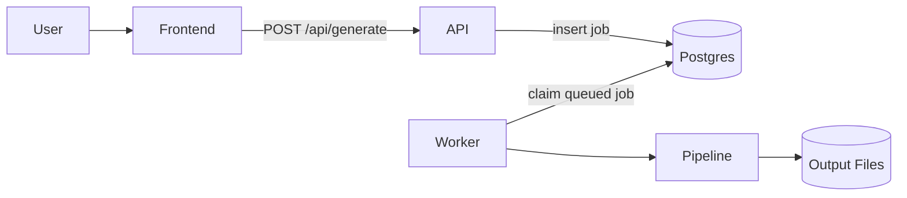

# MoneyPrinter 💸

MoneyPrinter automates the creation of YouTube Shorts by providing a video topic. The entire workflow - from script generation to video rendering - is powered by local AI models.

## What is MoneyPrinter?

MoneyPrinter is a fully Ollama-based video generation system that creates short-form videos for platforms like YouTube Shorts and TikTok. It handles:

- **Script generation** using local Ollama LLMs
- **Text-to-speech** via TikTok's voice API
- **Stock video sourcing** from Pexels
- **Subtitle generation** with AssemblyAI or local processing
- **Video composition** using FFmpeg and MoviePy
- **Optional background music** mixing
- **YouTube upload automation** with OAuth

## Key Features

<CardGroup cols={2}>
  <Card title="Ollama-First Architecture" icon="brain">
    Script generation and metadata creation are fully powered by local Ollama models. No cloud LLM APIs required.
  </Card>
  
  <Card title="Database-Backed Queue" icon="database">
    Reliable, restart-safe job processing with Postgres. Jobs survive API/worker restarts.
  </Card>
  
  <Card title="Real-Time Progress Tracking" icon="chart-line">
    Event-based logging system with live frontend updates. See every step of the generation pipeline.
  </Card>
  
  <Card title="Flexible Deployment" icon="docker">
    Run locally with Python or deploy with Docker Compose. Frontend, API, worker, and database all containerized.
  </Card>
</CardGroup>

## Architecture Overview

MoneyPrinter uses a modern queue-based architecture:

1. **Frontend** (HTML/JS) - Submit generation requests and monitor progress
2. **API** (Flask) - Validate input and enqueue jobs in Postgres
3. **Worker** - Claim queued jobs and run the generation pipeline
4. **Database** (Postgres/SQLite) - Source of truth for job state and events



## Why Ollama?

- **Privacy**: All AI processing happens locally on your machine
- **Cost**: No per-token API charges
- **Speed**: Low-latency inference with local models
- **Flexibility**: Use any Ollama-compatible model (Llama, Mistral, etc.)

## Use Cases

- **Content creators**: Generate shorts on trending topics
- **Educators**: Create bite-sized educational videos
- **Marketers**: Produce product explainer shorts
- **Developers**: Automate video content pipelines

## Quick Example

```bash
# 1. Start Ollama and pull a model
ollama serve
ollama pull llama3.1:8b

# 2. Run MoneyPrinter
uv run python Backend/main.py
uv run python Backend/worker.py
python3 -m http.server 3000 --directory Frontend

# 3. Open http://localhost:3000 and generate a video
```

## System Requirements

- **Python**: 3.11 or higher
- **Dependencies**: FFmpeg, ImageMagick, Ollama
- **Package Manager**: uv (recommended)
- **Database**: SQLite (local) or Postgres (Docker)

## Next Steps

<CardGroup cols={2}>
  <Card title="Quickstart" icon="rocket" href="/quickstart">
    Get MoneyPrinter running in under 5 minutes
  </Card>
  
  <Card title="Installation" icon="download" href="/setup/installation">
    Detailed installation and prerequisites guide
  </Card>
  
  <Card title="Architecture" icon="diagram-project" href="/concepts/architecture">
    Learn about the queue-based system design
  </Card>
  
  <Card title="Generating Videos" icon="video" href="/guides/generating-videos">
    How to create your first video
  </Card>
</CardGroup>

## Community & Support

- **GitHub**: [FujiwaraChoki/MoneyPrinter](https://github.com/FujiwaraChoki/MoneyPrinter)
- **Discord**: [Join our community](https://dsc.gg/fuji-community)
- **Issues**: Check existing issues before opening new ones

<Note>
MoneyPrinter is an open-source project. Contributions and feedback are welcome through GitHub issues and discussions.
</Note>
